<p align="center">
  
  
  
  
</p>

# 🚀 PathBound

> **Limit orders for remittances** — Rate-protected currency exchange for emerging markets, built on Stellar.

PathBound is a **non-custodial** decentralized application that empowers users to set an acceptable FX rate with a time window. The conversion executes **ONLY** if real orderbook liquidity exists at that rate; otherwise, funds remain untouched in the user's wallet.

---

## 📋 Table of Contents

- [Overview](#-overview)
- [Key Features](#-key-features)
- [How It Works](#-how-it-works)
- [Tech Stack](#-tech-stack)
- [Installation](#-installation)
- [Project Structure](#-project-structure)
- [Pages & Components](#-pages--components)
- [Stellar Integration](#-stellar-integration)
- [Trust Model & Security](#-trust-model--security)
- [Design System](#-design-system)
- [Contributing](#-contributing)
- [License](#-license)

---

## 🌟 Overview

Traditional currency exchange often leaves users vulnerable to unfavorable rates, especially in emerging markets where FX volatility can significantly impact remittance values. PathBound solves this by leveraging Stellar's native path payments to create **rate-protected** exchange intents.

### The Problem

- Users sending remittances have no control over exchange rates
- Market volatility can drastically reduce the amount received
- Centralized exchanges may not offer transparency on rates
- No way to set "limit orders" for currency conversion

### The Solution

PathBound allows users to:
- **Set a minimum acceptable rate** for their currency conversion
- **Define a time window** during which the exchange can execute
- **Maintain full custody** of funds until execution
- **Trust atomic execution** — transactions complete fully or not at all

---

## ✨ Key Features

| Feature | Description |
|---------|-------------|
| 🔒 **Non-Custodial** | Your Freighter wallet holds funds at all times — no deposits required |
| ⚡ **Stellar Native** | Uses native path payments and the built-in decentralized orderbook |
| ⏰ **Time-Bounded Safety** | Set expiration windows; expired transactions are automatically rejected |
| 💱 **Rate Protection** | Define minimum acceptable rates; no execution below your threshold |
| 📊 **Real-Time Liquidity** | View orderbook depth and liquidity estimates before transacting |
| 📈 **Market Rate Charts** | Visualize historical trade data from Stellar Horizon |
| 🔗 **Trustline Management** | Automatic detection and setup of required trustlines |
| 📜 **Transaction History** | Track all your exchange intents with status updates |
| 🌐 **Freighter Integration** | Seamless wallet connection and transaction signing |

---

## 🔄 How It Works

```mermaid
flowchart LR
    A[👤 User] -->|1. Define Intent| B[Set Amount, Rate, Time]
    B -->|2. Review & Sign| C[Sign with Freighter]
    C -->|3. Submit| D[Stellar Network]
    D -->|4a. Liquidity Exists| E[✅ Execute at Rate]
    D -->|4b. No Liquidity| F[❌ Funds Untouched]
    D -->|4c. Time Expired| G[⏰ Auto-Reject]
```



### Step-by-Step Flow

1. **Define Your Intent**
   - Select source and destination currencies (XLM, USDC, EURC)
   - Enter the amount you want to exchange
   - Set your minimum acceptable exchange rate
   - Choose a time window (1 min to 1 hour)

2. **Review Transaction Details**
   - View real-time orderbook liquidity
   - See execution probability based on current market
   - Preview the transaction before signing

3. **Sign with Freighter**
   - Securely sign the transaction with your Freighter wallet
   - No private keys ever leave your browser

4. **Automatic Execution**
   - Transaction submitted to Stellar network
   - Executes if rate conditions are met within time window
   - Fails safely if conditions aren't met — funds remain in your wallet

---

## 🛠 Tech Stack

### Frontend
- **React 18** — Modern React with hooks and concurrent features
- **TypeScript 5.2** — Type-safe development
- **Vite 5** — Lightning-fast HMR and build tooling
- **React Router 6** — Client-side routing

### Styling
- **Tailwind CSS 3.4** — Utility-first CSS framework
- **Custom Dark Theme** — Inspired by Stellar Lab's aesthetic
- **Three.js** — Dynamic background animations

### Blockchain
- **@stellar/stellar-sdk 12** — Full Stellar SDK integration
- **@stellar/freighter-api 6** — Wallet connection and signing
- **Horizon Testnet** — Real-time network data

---

## 📦 Installation

### Prerequisites

- **Node.js** 18+ 
- **npm** or **yarn**
- **Freighter Wallet** browser extension ([Download](https://freighter.app))

### Quick Start

```bash
# Clone the repository
git clone https://github.com/yourusername/pathbound.git
cd pathbound

# Install dependencies
npm install

# Start development server
npm run dev
```

Open [http://localhost:5173](http://localhost:5173) in your browser.

### Available Scripts

| Command | Description |
|---------|-------------|
| `npm run dev` | Start development server with HMR |
| `npm run build` | Build production bundle with TypeScript checking |
| `npm run preview` | Preview production build locally |
| `npm run lint` | Run ESLint for code quality checks |

### Environment Configuration

Create a `.env` file in the project root:

```env
VITE_HORIZON_URL=https://horizon-testnet.stellar.org
VITE_NETWORK_PASSPHRASE=Test SDF Network ; September 2015
```

---

## 📁 Project Structure

```
PathBound/
├── public/                 # Static assets
├── src/
│   ├── components/         # Reusable UI components
│   │   ├── ui/             # Core UI primitives (Button, Card, etc.)
│   │   ├── CurrencySelector.tsx
│   │   ├── Header.tsx
│   │   ├── Footer.tsx
│   │   ├── LiquidityPreview.tsx
│   │   ├── RateChart.tsx
│   │   ├── RateInput.tsx
│   │   ├── TimeWindowSelector.tsx
│   │   ├── TransactionPreview.tsx
│   │   ├── TrustlineSetup.tsx
│   │   └── PixelBlast.tsx  # Animated background
│   │
│   ├── context/
│   │   └── WalletContext.tsx   # Freighter wallet state management
│   │
│   ├── pages/
│   │   ├── Landing.tsx         # Home page with feature overview
│   │   ├── CreateIntent.tsx    # Main exchange form
│   │   ├── ReviewSign.tsx      # Transaction preview & signing
│   │   ├── IntentStatus.tsx    # Track execution status
│   │   └── History.tsx         # Past transaction history
│   │
│   ├── services/
│   │   └── stellar.ts          # Stellar SDK integration
│   │
│   ├── types/
│   │   └── index.ts            # TypeScript type definitions
│   │
│   ├── App.tsx                 # Main application with routing
│   ├── main.tsx                # Application entry point
│   └── index.css               # Global styles
│
├── package.json
├── tailwind.config.js
├── tsconfig.json
└── vite.config.ts
```

---

## 📄 Pages & Components

### Pages

| Page | Route | Description |
|------|-------|-------------|
| **Landing** | `/` | Introduction, feature overview, and "How It Works" section |
| **Create Intent** | `/create` | Main form to define exchange parameters |
| **Review & Sign** | `/review` | Preview transaction details and sign with Freighter |
| **Intent Status** | `/status/:id` | Track pending, executed, or expired intents |
| **History** | `/history` | View all past exchange intents with filters |

### Key Components

| Component | Purpose |
|-----------|---------|
| `Header` | Navigation with wallet connection status |
| `CurrencySelector` | Dropdown for selecting source/destination assets |
| `RateInput` | Input for minimum acceptable exchange rate |
| `TimeWindowSelector` | Choose transaction expiration time window |
| `LiquidityPreview` | Real-time orderbook visualization and execution probability |
| `RateChart` | Historical market rate visualization from Horizon |
| `TransactionPreview` | Detailed breakdown of the transaction before signing |
| `TrustlineSetup` | Automatic trustline creation for required assets |
| `PixelBlast` | Three.js animated background effect |

---

## 🔗 Stellar Integration

### Core Functionality: `path_payment_strict_receive`

PathBound uses Stellar's `path_payment_strict_receive` operation to guarantee users receive at least their minimum expected amount:

```typescript
import * as StellarSdk from '@stellar/stellar-sdk';

// Build path payment transaction
Operation.pathPaymentStrictReceive({
    sendAsset: sourceAsset,          // Asset user sends (e.g., USDC)
    sendMax: maxAmount,              // Maximum willing to send
    destination: userPublicKey,      // User receives back to their own account
    destAsset: destinationAsset,     // Asset to receive (e.g., XLM)
    destAmount: targetAmount,        // Exact amount to receive
    path: []                         // Network finds optimal path
})
```

### Supported Assets (Testnet)

| Asset | Description | Issuer |
|-------|-------------|--------|
| **XLM** | Native Stellar Lumens | — |
| **USDC** | USD Coin (Testnet) | `GBBD47IF6LWK7P7MDEVSCWR7DPUWV3NY3DTQEV` |
| **EURC** | Euro Coin (Testnet) | `GBBD47IF6LWK7P7MDEVSCWR7DPUWV3NY3DTQEV` |

### SDK Services

The `stellar.ts` service provides:

- `fetchOrderbook()` — Get real-time orderbook for asset pairs
- `estimateLiquidity()` — Calculate execution probability at target rate
- `findPaymentPaths()` — Discover optimal payment routes
- `buildPathPaymentTransaction()` — Create the transaction envelope
- `submitTransaction()` — Submit signed transaction to Horizon
- `checkTransactionStatus()` — Monitor transaction execution
- `checkTrustlines()` — Verify required trustlines exist
- `buildTrustlineTransaction()` — Create trustline if needed

---

## 🔐 Trust Model & Security

### Why PathBound is Safe

| Security Feature | How It Protects You |
|-----------------|-------------------|
| **Non-Custodial** | No deposits; funds stay in your Freighter wallet |
| **Atomic Execution** | Stellar path payments execute fully or not at all |
| **Time Bounds** | `maxTime` field causes automatic rejection after deadline |
| **Backend Independence** | Signed transactions continue processing even if our servers go down |
| **Client-Side Signing** | Private keys never leave your browser |
| **No Smart Contracts** | Uses native Stellar operations — battle-tested and audited |

### Transaction Lifecycle

```
┌─────────────────────────────────────────────────────────────┐
│                    TRANSACTION STATES                        │
├─────────────────────────────────────────────────────────────┤
│                                                              │
│   [PENDING] ──────┬────────────> [EXECUTED]                 │
│       │           │                   │                      │
│       │     Rate Met +                │ Success!             │
│       │     Time Valid                │ Funds Exchanged      │
│       │                               │                      │
│       └──────────────────────────> [EXPIRED]                │
│                                       │                      │
│                                Time Bound Exceeded           │
│                                Funds Remain in Wallet        │
│                                                              │
└─────────────────────────────────────────────────────────────┘
```

---

## 🎨 Design System

### Color Palette

| Token | Hex | Usage |
|-------|-----|-------|
| `bg-primary` | `#0A0A0F` | Main background |
| `bg-secondary` | `#121218` | Card backgrounds |
| `accent-primary` | `#6366F1` | Interactive elements |
| `accent-secondary` | `#8B5CF6` | Hover states, highlights |

### Typography

- **UI Text**: Inter (Google Fonts)
- **Technical Data**: JetBrains Mono (monospace)

### Design Principles

- ✨ **Dark Mode First** — Optimized for low-light environments
- 📱 **Responsive** — Mobile-friendly layouts
- ⚡ **Performance** — Minimal bundle size with code splitting
- 🎯 **Clarity** — Clear visual hierarchy for complex financial data

---

## 🤝 Contributing

We welcome contributions! Please follow these steps:

1. **Fork** the repository
2. **Create** a feature branch (`git checkout -b feature/amazing-feature`)
3. **Commit** your changes (`git commit -m 'Add amazing feature'`)
4. **Push** to the branch (`git push origin feature/amazing-feature`)
5. **Open** a Pull Request

### Development Guidelines

- Follow TypeScript best practices
- Write meaningful commit messages
- Add tests for new features
- Update documentation as needed

---

## 📄 License

This project is open source and available under the [MIT License](LICENSE).

---

<p align="center">
  <strong>Built for emerging markets. Non-custodial. Stellar-native.</strong>
  <br><br>
  <a href="https://stellar.org">
    
  </a>
</p>
